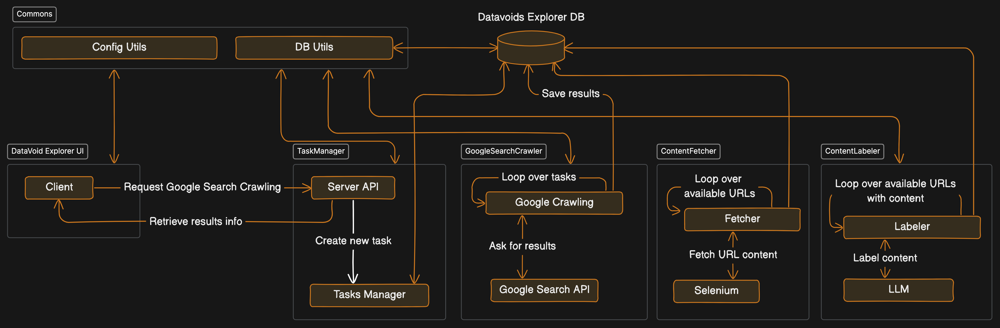
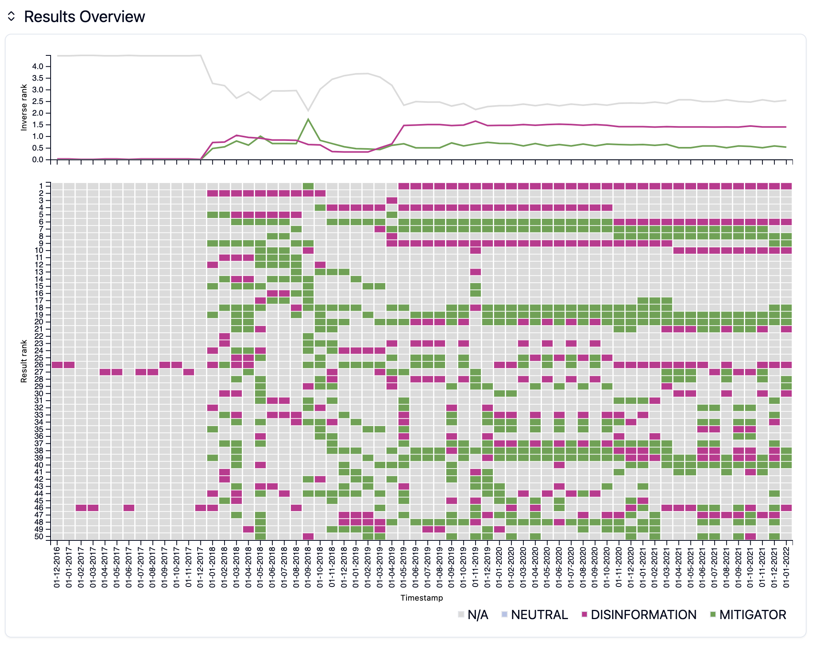

# DataVoid Explorer

DataVoid Explorer helps users to:

- Retrieve and store the top K Google Search results over time
- Retrieve their content
- Label the content using LLMs and manual labeling
- Display results

## Architecture

The microservices architecture enables the separation of concerns and allows for independent
development even using different technologies, deployment, and scaling.

The architecture is composed of the following components:

- **DataVoid Explorer UI** which serves the UI as a web application.
- **TaskManager** which manages the tasks and the status of the tasks.
- **GoogleSearchCrawler** which retrieves the Google Search results.
- **ContentFetcher** which retrieves the content of the URLs.
- **ContentLabeler** which labels the content of the URLs.

Having separate services also means that slow content fetching does not block for example google search crawling. Furthermore, content fetching can be demanding in terms of resources,
so it can be scaled independently. Similarly, ContentLabeler can be scaled independently across
multiple API keys or using more than one technology (e.g. some instances using ChatGPT, and some
using LLama2).



## TasksManager

Make sure that all dependencies are installed with `pipenv` at the root directory with

```
pipenv install
```

The **TaskManager** manages the tasks and the status of the tasks. Run the **TasksManager** with:

```bash
source tasks-manager.sh
```

## GoogleSearchCrawler

The **GoogleSearchCrawler** independently retrieves the Google Search Crawling tasks, and executes them when needed.

Run the server

```bash
source google-search-crawler.sh
```

## ContentFetcher

The **ContentFetcher** independently retrieves the content of the URLs from the Google Search results.

Run the server

```bash
source content-fetcher.sh
```

## ContentLabeler

The **ContentLabeler** independently labels the content of the URLs from the Google Search results.

Run the server

```bash
source content-labeler.sh
```

## DataVoid Explorer UI

The UI allows to specify the keywords to use for Google Search,
a time range and the frequency of collection. The UI also allows to define a narrative for the
disinfomer, one for the mitigator, and one neutral narrative, to be able to label the content.

All of these specifications can be submitted to the TaskManager. The UI shows the current status
of the running task that was submitted.

Run the UI with:

```bash
source ui.sh
```

This will run the UI at [http://localhost:5173](http://localhost:5173) unless configured differently.

To submit a new task go to [http://localhost:5173](http://localhost:5173) where a new task can be created and submitted.


To see the list of tasks and their status go to [http://localhost:5173/tasks](http://localhost:5173/tasks).

To see a particular task summary click one of the tasks available. This will open a new page `http://localhost:5173/task/TASK_ID`

https://github.com/huda-lab/datavoids-explorer/assets/160922/264fb065-bfdf-410f-ac2f-7535cf86ea92

The following is an example of a more complete data collection from the Nellie Ohr conspiracy.



## Config.json

The `config.json` file serves for setting up the DataVoid Explorer project, guiding the integration and operation of its microservices architecture. Key parameters such as service URLs, operation ports, task checking intervals, Google API keys, and database connection details are defined here. This allows the communication between services, and correct functioning of each service.

Here is an example of this configuration file:

```json
{
  "datavoids_explorer_ui": {
    "tasks_manager_url": "http://localhost:5000"
  },
  "tasks_manager": {
    "port": "5000"
  },
  "google_search_crawler": {
    "interval": 1000,
    "num_results": 10,
    "google_search_api": {
      "key": "<SECRET>",
      "cse_id": "<SECRET>"
    }
  },
  "content_labeler": {
    "interval": 1000,
    "labeler": "chat_gpt"
  },
  "content_fetcher": {
    "interval": 1000,
    "always_use_selenium": false,
    "headless": true,
    "timeout": 30,
    "ignore_extensions": [
      "pdf",
      "xsls",
      "txt"
    ]
  },
  "databases": {
    "datavoids_explorer": {
      "name": "datavoids_explorer",
      "user": "postgres",
      "password": "<SECRET>",
      "host": "localhost",
      "port": "5432"
    },
    "datavoids_simulator_work": {
      "name": "mis_sim_work",
      "user": "postgres",
      "password": "<SECRET>",
      "host": "localhost",
      "port": "5432"
    }
  },
  "APIs": {
    "open_ai": {
      "key": "<SECRET>",
      "model": "gpt-3.5-turbo",
      "target_tokens": 4000
    },
    "google_sheets_api": {
      "credentials_file": "gsa_cred.json"
    }
  }
}
```

## Google API

### Create a Service Account

- Go to the [Google Cloud Console](console.cloud.google.com)
- Create/Select the project

- Enable the Google Sheets API: Navigate to the "APIs & Services" dashboard. To enable Google Sheets API go to <https://console.cloud.google.com/flows/enableapi?apiid=sheets.googleapis.com>

- Create a Service Account:
  - Go to "IAM & Admin" > "Service Accounts", and click “Create Service Account”
  - Give it a name, description, and click "Create".
  - Assign the necessary roles for the API you are using. For example, if you’re using Google Drive API, you might assign it a role such as "Editor" or specific Google Drive roles.
  - Click "Done" to create the service account.

- Create Keys:
  - Click on the created service account, go to "Keys", and add a new key.
  - Choose JSON as the key type. This will download a JSON key file to your machine.
  - Change `config.json` specifying the path of this JSON file:

- Enable Google Drive API
  <https://console.developers.google.com/apis/api/drive.googleapis.com/overview>

```json
"APIs": {
  /* ... */
  "google_sheets_api": {
    "credentials_file": "service_account_key.json"
  }
}
```

### Google Search API Configuration

Create a programmable search engine at [https://programmablesearchengine.google.com/controlpanel/all](https://programmablesearchengine.google.com/controlpanel/all).

Go to [https://developers.google.com/custom-search/v1/overview](https://developers.google.com/custom-search/v1/overview)

## Data Importer

Data can be imported with `DataImporter/import_data.py`. Read `DataImporter/README.md` for more information.
